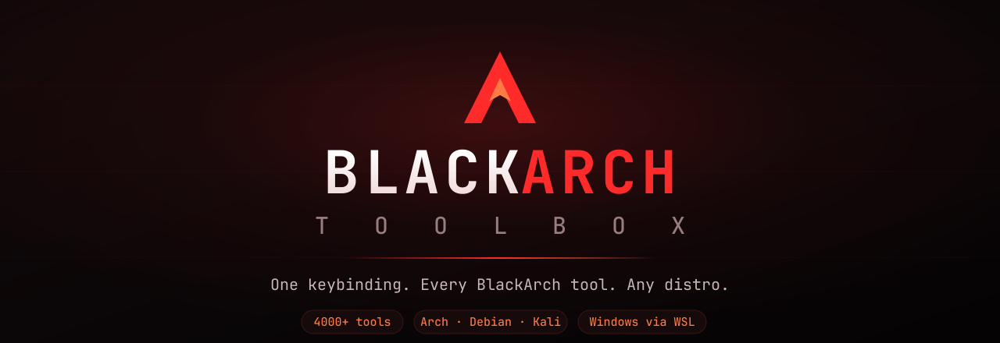
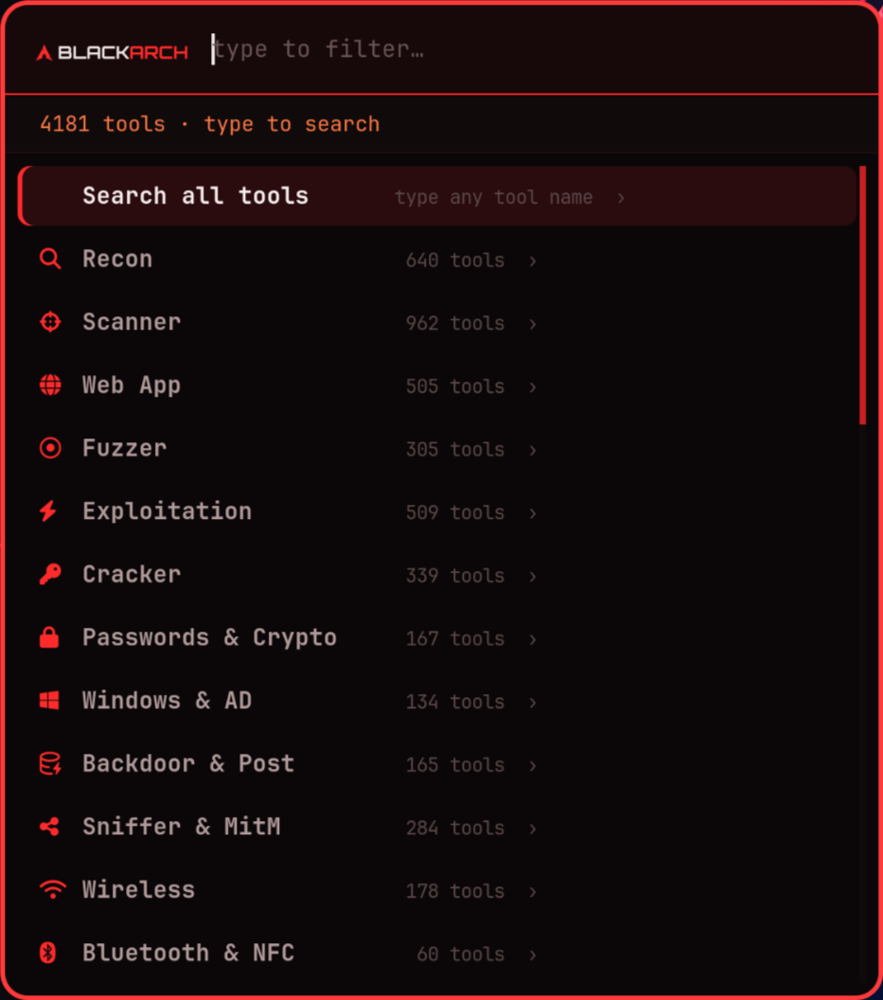
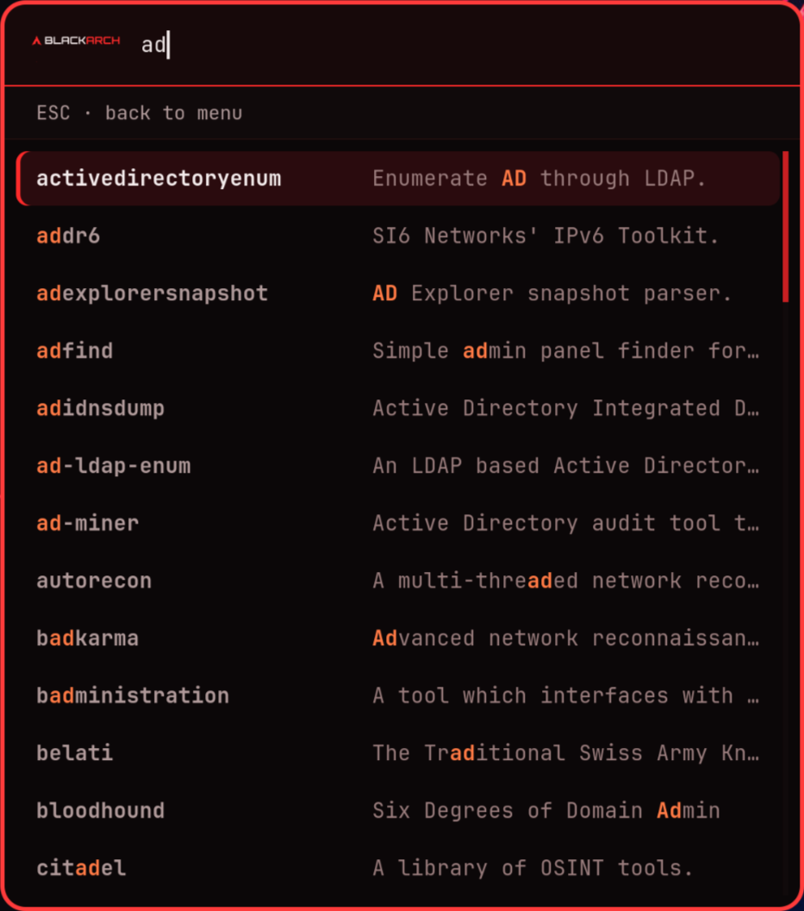
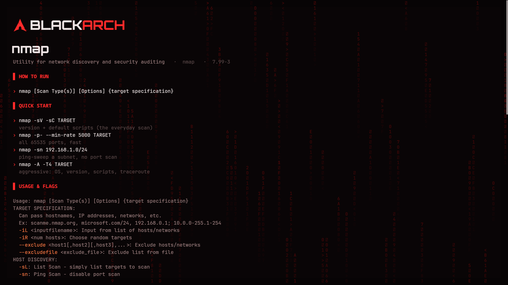

<div align="center">



**One keybinding to launch any of BlackArch's ~4000 security tools — from a clean, searchable menu, on any Linux distro, macOS, or Windows.**

[](CHANGELOG.md)
[](docs/INSTALL.md)
[](lib/)
[](LICENSE)

</div>

---

## What it is

BlackArch ships thousands of security tools, but finding and remembering how to
run them is its own job. **BlackArch Toolbox** turns the whole arsenal into a
single keystroke: press **`Alt`+`A`**, then either type a tool's name or pick a
category and drill in. Whatever you choose opens — a GUI tool in its own window,
a command-line tool in a themed terminal that shows you exactly how to run it
first.

<div align="center">

| Level 1 — search entry + sections | Level 2 — the tools, filtered as you type |
|:---:|:---:|
|  |  |



*The per-tool view: usage, flags and a shell scoped to that tool.*

</div>

It works the same everywhere: on **Arch/BlackArch** it reads BlackArch's own
package groups for full ~4000-tool fidelity; on **Debian, Ubuntu, Kali, Parrot,
Fedora, openSUSE, Alpine, macOS and Windows/WSL** it resolves a curated tool
catalogue against your `PATH`, so a tool shows up no matter how you installed it.

---

## Highlights

- **⌨️  One keybinding, everywhere** — `Alt`+`A` on Hyprland, sway, i3, GNOME,
  and Windows; a menu in any terminal over SSH.
- **🧭  Two-level menu** — level 1 is a search entry plus 27 sections ordered
  like an engagement (recon → scan → exploit → escalate → specialist benches);
  level 2 is the tools themselves, filtered as you type.
- **✅  Only runnable tools** — every entry is an executable that exists on your
  machine right now. No dead menu rows.
- **📖  Never a blank prompt** — CLI tools open into a screen with their
  description, synopsis, a curated quick-start for common tools, and a cleaned
  flag list, then a shell scoped to that tool with its own history.
- **🐧  Truly cross-distro** — pluggable package backends (pacman + a universal
  PATH catalogue) and menu backends (rofi / fuzzel / wofi / dmenu / fzf).
- **🪟  Windows via WSL** — same menu, same `Alt`+`A`, driven by a global hotkey.
- **🧩  Easy to extend** — add your own tools with a single line of text.
- **↩️  Reversible install** — no root, everything in your home, clean uninstall.

---

## Platform support

Works on any reasonably modern system. The launcher is Bash + awk, so the real
requirement is just **Bash ≥ 4** and a menu program; the table shows the
versions it's verified against and the kernel each needs.

| OS | Verified versions | Kernel | Backend | Notes |
|----|-------------------|--------|---------|-------|
| **BlackArch** | rolling | Linux ≥ 5.x | `pacman` | full ~4000-tool index |
| **Arch / Manjaro / EndeavourOS** | rolling | Linux ≥ 5.x | `pacman` | add BlackArch repo for the full set |
| **Kali Linux** | 2023.x – 2025.x | Linux ≥ 5.10 | `catalog` | most tools preinstalled |
| **Parrot OS** | 5.x / 6.x | Linux ≥ 5.10 | `catalog` | most tools preinstalled |
| **Debian** | 11 / 12 / 13 | Linux ≥ 5.10 | `catalog` | install tools via `apt` / Kali metapkgs |
| **Ubuntu** | 20.04 / 22.04 / 24.04 | Linux ≥ 5.4 | `catalog` | — |
| **Fedora** | 38 – 41 | Linux ≥ 6.x | `catalog` | — |
| **RHEL / Rocky / Alma** | 8 / 9 | Linux ≥ 4.18 | `catalog` | — |
| **openSUSE** | Leap 15.x / Tumbleweed | Linux ≥ 5.3 | `catalog` | — |
| **Alpine** | 3.18+ | Linux ≥ 5.x | `catalog` | needs `bash` + `gawk` |
| **macOS** | 12 Monterey – 15 Sequoia | Darwin (Intel/Apple Silicon) | `catalog` | Homebrew `bash` required |
| **Windows** | 10 / 11 | WSL 2 (Linux ≥ 5.15) | `catalog` | tools run inside a WSL distro |

> **Bash ≥ 4**, **awk** (gawk or busybox), and one menu (`rofi` / `fuzzel` /
> `wofi` / `dmenu` on a desktop, or `fzf` anywhere). Everything else is optional.
> Check your own versions with `bash --version`, `uname -sr`, and — after install
> — `blackarch-toolbox --version`.

## Install

> **TL;DR** — clone and run `./install.sh`. It needs no root, wires up
> `Alt`+`A`, and builds the index. Full per-distro steps (dependency package
> names for every OS) live in **[docs/INSTALL.md](docs/INSTALL.md)**.

```bash
git clone https://github.com/nithin2719-commits/Blackarch_Toolbox.git
cd Blackarch_Toolbox
./install.sh
```

Then press **`Alt`+`A`**, or run `blackarch-toolbox`.

<details>
<summary><b>Per-distro one-liners</b> (dependencies only — see the full guide for details)</summary>

```bash
# Arch / BlackArch / Manjaro / EndeavourOS
sudo pacman -S rofi kitty fzf

# Debian / Ubuntu / Kali / Parrot
sudo apt install -y rofi kitty fzf git

# Fedora / RHEL / Rocky / Alma
sudo dnf install -y rofi kitty fzf git

# openSUSE
sudo zypper install -y rofi kitty fzf git

# Alpine
sudo apk add bash gawk fzf git

# macOS (Homebrew)
brew install bash gawk fzf git && brew install --cask kitty
```

Then in every case: `git clone … && cd Blackarch_Toolbox && ./install.sh`

</details>

<details>
<summary><b>Windows (WSL)</b></summary>

BlackArch's tools are Linux binaries, so on Windows they run through WSL. The
PowerShell installer adds a Start-menu shortcut and a global `Alt`+`A` hotkey.

```powershell
wsl --install -d kali-linux          # once, then reboot (or -d Ubuntu / -d Debian)
powershell -ExecutionPolicy Bypass -File windows\install.ps1
```

Full steps: **[docs/INSTALL.md ▸ Windows](docs/INSTALL.md#windows-wsl)**.

</details>

---

## Usage

The menu has exactly two levels, and the top one stays short on purpose — the
arsenal is never dumped into the default view.

**Level 1** — a single **Search all tools** entry, then the 27 sections with
their tool counts. One line of status above them: how many tools are indexed,
and the reminder that typing filters.

**Level 2** — the list you drilled into, either the whole arsenal or one
section. Type to filter, `Enter` launches, `Esc` goes back up. Each row is the
tool name padded to a fixed column with its description beside it, so the
descriptions line up as a second column rather than a ragged dump.

Filtering is **substring** matching, not fuzzy: typing `metasp` gives you the
metasploit family and nothing else. (Fuzzy matching scatters the query letters
across the row, which is how `metasploit` used to return `mentalist`.)

| Action | How |
|--------|-----|
| Open the menu | **`Alt`+`A`**, or `blackarch-toolbox` |
| Search every tool | open **Search all tools**, then type any tool name |
| Browse a category | pick a section (e.g. **Web App**) to drill into it |
| Go back a level | `Esc` |
| Close the menu | `Esc` again, or press `Alt`+`A` a second time |
| Rebuild the index (after installing tools) | `blackarch-toolbox --refresh` |
| Open one tool by name | `blackarch-toolbox --run nmap` |
| List every indexed tool | `blackarch-toolbox --list` |
| Show settings & paths | `blackarch-toolbox --config` |

When you pick a **CLI tool**, it opens in a themed terminal showing its usage and
flags, then hands you a shell scoped to that tool — type `run …`, `help`,
`flags`, or `man` as shortcuts. A **GUI tool** just opens its own window (resolved
through its desktop entry, so even apps with unusual launch names open reliably).

---

## Keyboard shortcut

The installer binds the toolbox to **`Alt`+`A`** on whatever desktop you run, by
writing a single, clearly-marked block it can later remove cleanly:

| Desktop | Where the binding is written |
|---------|------------------------------|
| **Hyprland** | `~/.config/hypr/keybindings.conf` (or `hyprland.conf`) |
| **sway** | `~/.config/sway/config` |
| **i3** | `~/.config/i3/config` |
| **GNOME** | a custom shortcut via `gsettings` |
| **KDE** | guided steps (System Settings ▸ Shortcuts) |
| **Windows** | global hotkey via AutoHotkey (see [Windows install](docs/INSTALL.md#windows-wsl)) |

**Change the key** — pass `--key` at install time:

```bash
./install.sh --key "SUPER B"      # bind Super+B instead
./install.sh --no-keybind         # don't touch any config; bind it yourself
```

**Bind it by hand** (any launcher) — just run the command `blackarch-toolbox`.
For example, on Hyprland:

```ini
bind = ALT, A, exec, blackarch-toolbox
```

Pressing the key again while the menu is open closes it.

---

## The tool sections

The menu is organised into 27 sections, in the order an engagement actually
flows. On Arch/BlackArch each maps to BlackArch's package groups; elsewhere to
catalogue categories.

| | Section | What's inside |
|---|---------|---------------|
| 🔎 | **Recon** | nmap, masscan, amass, subfinder, theHarvester, recon-ng, httpx… |
| 🎯 | **Scanner** | nuclei, nikto, openvas, nessus, trivy, lynis, testssl.sh… |
| 🕸️ | **Web App** | sqlmap, gobuster, feroxbuster, wpscan, ffuf, burpsuite, ZAP… |
| 💥 | **Fuzzer** | ffuf, wfuzz, afl++, honggfuzz, radamsa, boofuzz… |
| 🧨 | **Exploitation** | metasploit, searchsploit, setoolkit, sliver, netexec… |
| 🔓 | **Cracker** | hashcat, john, hydra, medusa, ncrack, name-that-hash… |
| 🔐 | **Passwords & Crypto** | openssl, gpg, age, sops, RsaCtfTool, featherduster… |
| 🪟 | **Windows & AD** | impacket, bloodhound, certipy, kerbrute, responder, evil-winrm… |
| 🚪 | **Backdoor & Post** | weevely, msfvenom, chisel, ligolo-ng, pupy… |
| 🦠 | **Malware** | yara, clamav, capa, floss, Detect-It-Easy… |
| 👂 | **Sniffer & MitM** | wireshark, tcpdump, ettercap, bettercap, ngrep… |
| 🔀 | **Proxy** | mitmproxy, proxychains, socat, stunnel… |
| 📡 | **Wireless** | aircrack-ng, wifite, kismet, reaver, hcxdumptool, fluxion… |
| 📶 | **Bluetooth & NFC** | bluetoothctl, btscanner, mfoc, mfcuk, proxmark3… |
| 📻 | **Radio & SDR** | rtl_433, gqrx, gnuradio, multimon-ng, hackrf… |
| 🔬 | **Reversing** | ghidra, cutter, rizin, radare2, gdb, jadx… |
| 🧱 | **Binary** | pwntools, ropper, one_gadget, checksec, patchelf, upx… |
| 🧾 | **Forensic** | volatility, autopsy, sleuthkit, binwalk, foremost, steghide… |
| 🛡️ | **Defensive** | suricata, zeek, snort, fail2ban, rkhunter, chkrootkit… |
| 🕵️ | **Social & OSINT** | sherlock, maigret, holehe, spiderfoot, maltego, h8mail… |
| 📱 | **Mobile** | apktool, jadx, mobsf, frida, objection, adb, scrcpy… |
| 🌐 | **Networking** | netcat, ncat, hping3, scapy, netdiscover, arp-scan, mtr… |
| 🗄️ | **Database** | sqlmap, nosqlmap, mongoaudit, mysql, psql, redis-cli… |
| 🧑‍💻 | **Code Audit** | semgrep, bandit, gitleaks, trufflehog, brakeman, safety… |
| ⚙️ | **Automation** | reconftw, osmedeus, autorecon, sn0int… |
| 🍯 | **Honeypot** | cowrie, honeyd, opencanary, pentbox… |
| 🔩 | **Hardware & Firmware** | flashrom, openocd, sigrok, esptool, binwalk… |

*(plus **DoS** and **Misc** for everything else.)*

---

## Adding your own tools

The box shows what's installed. To add a tool it doesn't know yet, it's **one
line of text** — full guide in **[docs/ADDING-TOOLS.md](docs/ADDING-TOOLS.md)**.

**On Arch/BlackArch** there's nothing to do — install the package and refresh:

```bash
sudo pacman -S sqlmap && blackarch-toolbox --refresh
```

**On any other OS**, add a tab-separated line to
[`data/catalog.tsv`](data/catalog.tsv) — `binary`, `category`, `description`:

```
dnsx	recon	Fast and multi-purpose DNS toolkit
```

…then `blackarch-toolbox --refresh`. The tool appears in **Recon** as soon as
`dnsx` is on your `PATH`.

---

## Configuration

Copy [`config/config.example`](config/config.example) to
`~/.config/blackarch-toolbox/config`, or set any of these as environment
variables for a one-off run:

| Variable | Values | Meaning |
|----------|--------|---------|
| `BAT_MENU` | `auto` · rofi · fuzzel · wofi · dmenu · fzf | which picker to use |
| `BAT_TERMINAL` | `auto` · kitty · alacritty · foot · … | terminal for CLI tools |
| `BAT_BACKEND` | `auto` · pacman · catalog | package backend |
| `BAT_GUI_MODE` | `auto` · always-terminal | force the terminal view for GUI tools |

```bash
BAT_MENU=fzf blackarch-toolbox        # e.g. force the terminal menu over SSH
```

---

## How it works

```
  Alt+A ─▶ bin/blackarch-toolbox ─▶ lib/launcher.sh
                                       │
              ┌────────────────────────┼─────────────────────────┐
              ▼                        ▼                          ▼
        lib/menu.sh              lib/refresh.sh              lib/terminal.sh
     (rofi/fuzzel/wofi/       builds the index via a       (kitty/alacritty/
      dmenu/fzf picker)       package backend …            foot/… + inline)
                                       │
                       ┌───────────────┴───────────────┐
                       ▼                                ▼
             lib/backends/pacman.sh          lib/backends/catalog.sh
          (BlackArch pacman groups,        (data/catalog.tsv resolved
           ~4000 tools on Arch)             against PATH, every other OS)
```

- **Backends** answer one question — *"which runnable tools exist, and in what
  category?"* — so adding OS support is adding a backend, not touching the UI.
- The index and every per-tool help/history file live under
  `~/.cache/blackarch-toolbox`, never in the repo, so one system-wide install
  serves multiple users.
- The launcher does **zero per-tool work at click time** — every menu row,
  including its pango markup and its padded name column, is pre-rendered by
  `lib/render.awk` at index time, so opening even a 900-tool section is instant.
- Picking a row returns its **index**, never its text, so the pretty display
  column stays fully decoupled from the binary that actually gets launched.

---

## Requirements

- **Bash ≥ 4** and **awk** (gawk or busybox awk) — present on essentially every
  Linux/macOS system (macOS needs Homebrew's bash).
- **A menu**: `rofi` / `fuzzel` / `wofi` / `dmenu` on a desktop, or `fzf`
  anywhere (including headless/SSH).
- **Optional**: `kitty` for the richest per-tool view; `magick` (ImageMagick)
  for the inline tool-name banner; `notify-send` for launch notifications.

---

## Uninstall

```bash
./install.sh --uninstall                            # Linux / macOS / WSL
powershell -File windows\install.ps1 -Uninstall     # Windows side
rm -rf ~/.cache/blackarch-toolbox                   # purge the cache too
```

---

## Troubleshooting

Common fixes — GUI tool won't open, menu feels slow, no tools shown, `Alt`+`A`
not working — are collected in
**[docs/TROUBLESHOOTING.md](docs/TROUBLESHOOTING.md)**.

## Contributing

Catalogue additions are just text — open a PR against
[`data/catalog.tsv`](data/catalog.tsv) (sorted by category, one-sentence
descriptions). See **[CONTRIBUTING.md](CONTRIBUTING.md)**. Bug reports and new
backends welcome.

## License

[MIT](LICENSE) © 2026 Nithin G. BlackArch and its logo are trademarks of the
BlackArch Linux project; this is an independent launcher, not affiliated with
or endorsed by BlackArch.
